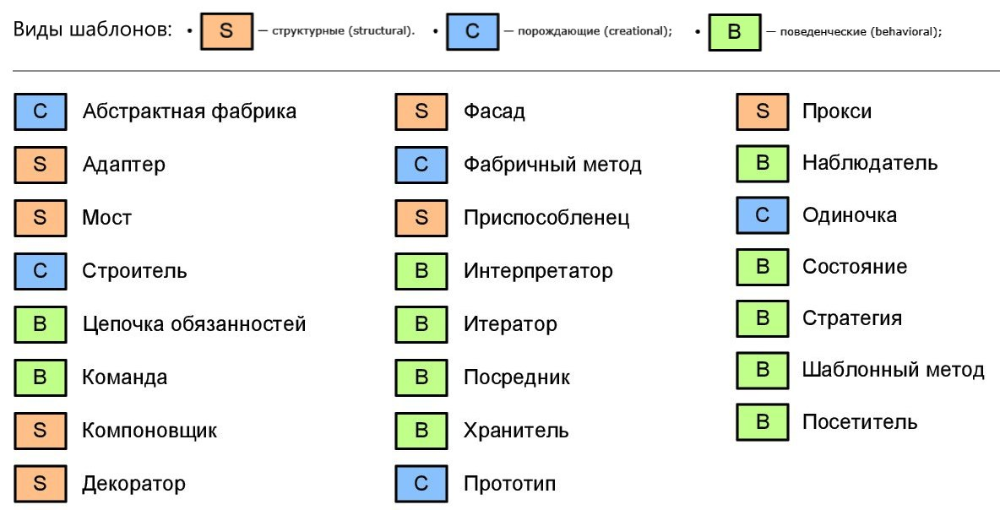

# samples-patterns
Проект представляет собой описание и реализацию 23 основых шаблонов проектирования (паттернов банды четырех).  
Этот репозиторий я сделал на русском языке, потому что это, прежде всего, шпаргалка для меня самого.  
В папке каждого из 23х паттернов проектирования есть main файл, содержащий метод main.  
В этом файле я в формате многострочного комментария разместил всю информацию (свою и найденную на просторах интернета, кстати говоря из интернета чаще всего брал статьи [отсюда](https://radioprog.ru/category/183)) которая показалась мне полезной, и способна дать понимание сути паттерна максимально сжато.  
Все примеры реализаций (классы) я придумывал сам, основываясь на своем понимании данных шаблонов.  

